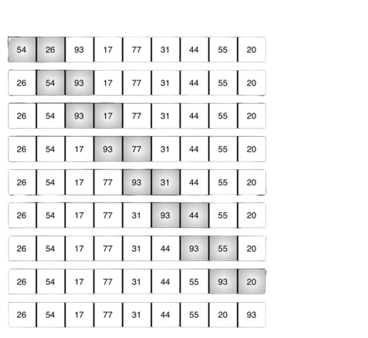
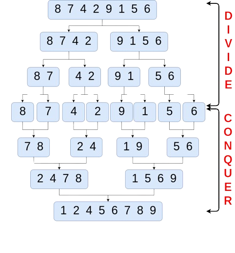

# Sorting algorithms
The aim of this repository is to describe and implement some of the most famous sorting algorithms:
1. Bubble sort algorithm
2. Merge sort algorithm
3. Quick sort algorithm

In order to provide a comprehensive explanation, this README reviews all alortihm emphasizing the pros and cons of each.

## Bubble sort
Bubble sort is a comparison-based sorting algorithm that repeatedly swaps adjacent elements if they are in the wrong order.
The bubble sort algorithm follows a simple, step-by-step process. Starting at the beginning of the list, it compares adjacent elements and swaps them if they are sorted incorrectly. This process continues iteratively until the entire list is sorted. During each iteration, the greatest unsorted element gradually "bubbles" toward the end of the list.

The time complexity of the bubble sort in the worst case is $O(n^2)$ making it less efficient compared to others algorithms.
The strenght of the bubble sort is that it is simple to implement. The main disadvantage, however, is that due to its complexity it is not recommended for large datasets. In this case it would be very time consuming. Moreover, even if the dataset is sorted before the number of iterations, the algorithm continues to run because there is no way to tell that the job is finished.

## Merge sort
The Merge sort algorithm is one of the most efficient sorting algorithms. It is based on the divide-and-conquer strategy. Merge sort continuously cuts down a list into multiple sublists until each has only one item, then merges those sublists into a sorted list. The “Merge Sort”  uses a *recursive algorithm* to achieve its results.

Merge sort is more efficient than bubble sort. Its time complexity is $O(n log n)$. The disadvantage, like bubble sort, is that even if the array is sorted, merge sort retraces the entire process. Also, merge sort is not recommended for small datasets, but works well with larger ones.

## Quick sort
To implement.